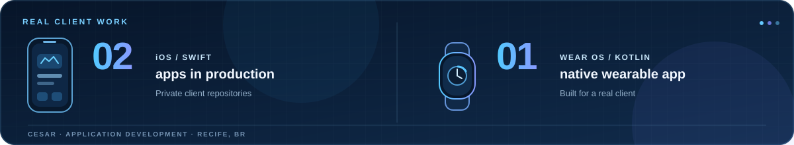
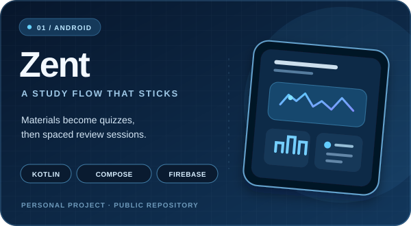
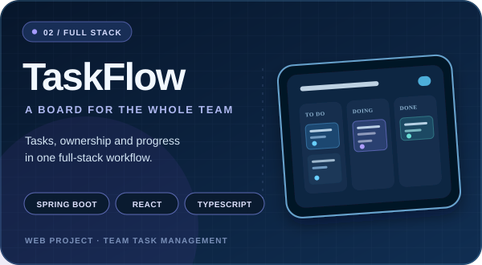

  

<h1 align="center">Galileu Calaça Menezes de Moraes</h1>

  <strong>Native mobile, from iPhone to wrist.</strong> 
  iOS · Android · Wear OS

Recife, Brazil · CESAR

  

---

## My work, from phone to wrist

I'm Galileu, a mobile developer in Recife and an application development intern at CESAR. Over the past year, I've worked on two Swift apps now in production and a Kotlin app for Wear OS for a real client. That mix of phones and wearables is the clearest snapshot of my work: native mobile. I also build web projects, but iOS and Android are my main focus.

## Built for clients

  

## Public projects

<table align="center" width="100%">
  <tr>
    <td align="center" valign="top" width="50%">
      
      
An Android study app for organizing materials, generating quizzes, and planning spaced reviews.

      
<a href="https://github.com/GalileuCMMoares/Zent">Explore Zent →</a>

    </td>
    <td align="center" valign="top" width="50%">
      
      
A Jira-style team task manager with a Spring Boot API, PostgreSQL, Google sign-in, and a React/TypeScript interface.

      
<a href="https://github.com/GalileuCMMoares/TaskFlow">Explore TaskFlow →</a>

    </td>
  </tr>
</table>

## Tools I use

  

  <strong>Mobile first:</strong> Swift · Kotlin · iOS · Android · Wear OS 
  <strong>Also building for the web:</strong> Java · Spring Boot · React · TypeScript

---
